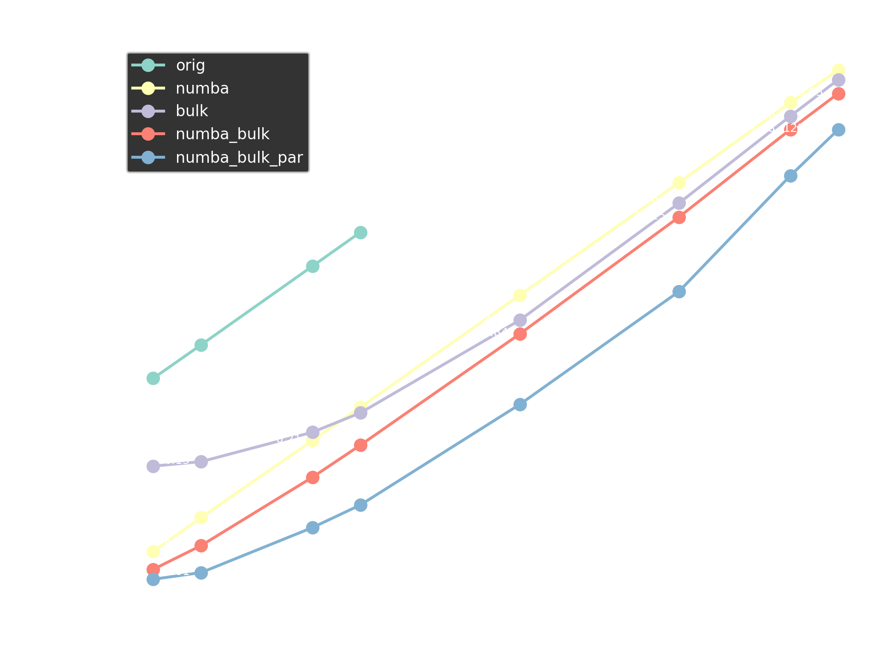

# CyTRIM
A Python/Cython implementation of TRIM. This particular branch contains different implementations including a benchmark (main.py) to test them all under different conditions

## Directories:
    .: Misc. scripts
    pytrim: Source code (including benchmark)
        .: Original source code
        bulk: Optimized NumPy usage
        numba_local: Using Numba JIT with the original version
        numba_bulk: NumPy + Numba optimizations
        numba_bulk_par: Parallelized implementation above
    perf: Performance metrics using cProifle
    
## Performance comparison

Machine specs:
- Intel Core i5-12500H (10 threads @ numba_bulk_par)
- 24GB DDR4

